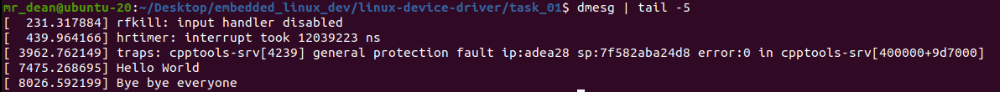

<h2> TASK 1 </h2>
- Building out of tree kernel module.
- This external module is built against a complete and precompiled kernel source tree.

## 1. Steps
- Compile the module against the host kernel
```shell
make host
```
- You can use the command below to check the module info
```shell
modinfo hello_world_mod.ko
```
- Insert and remove the module
```shell
sudo insmod hello_world_mod.ko
suod rmmod hello_world_mod.ko
```
- You use the command below to view the install module from dmesg
```shell
dmesg | tail -5
```
